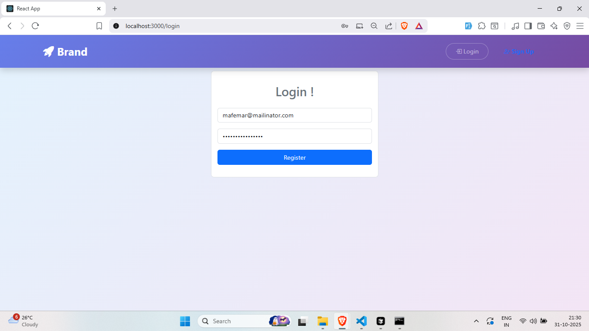
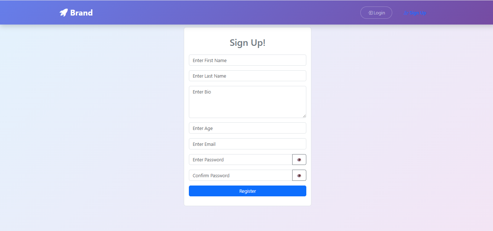
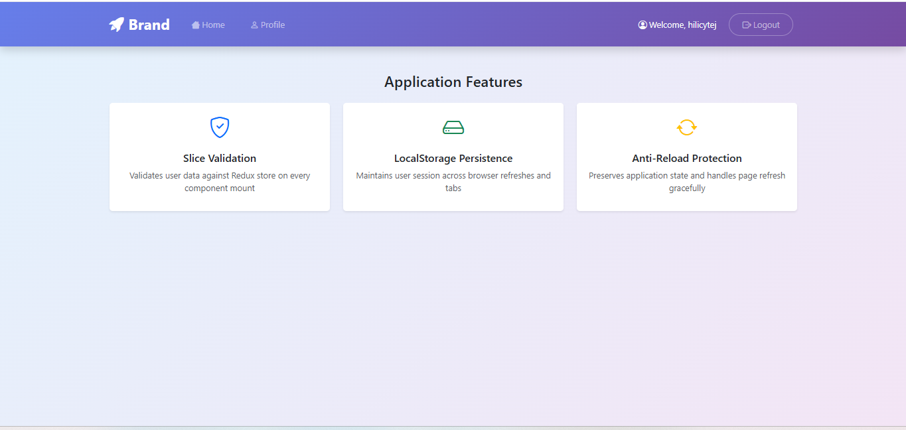
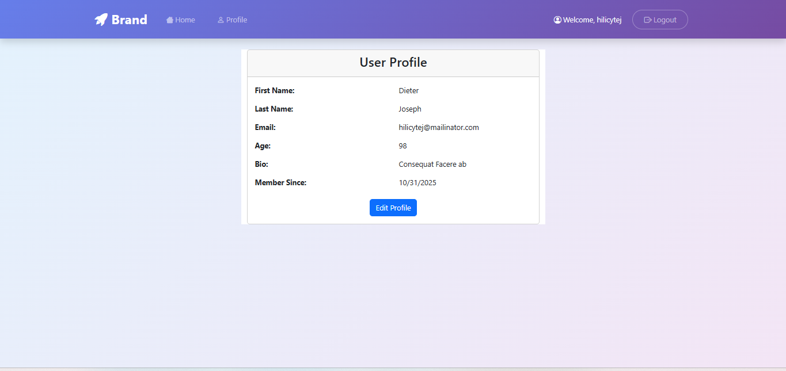
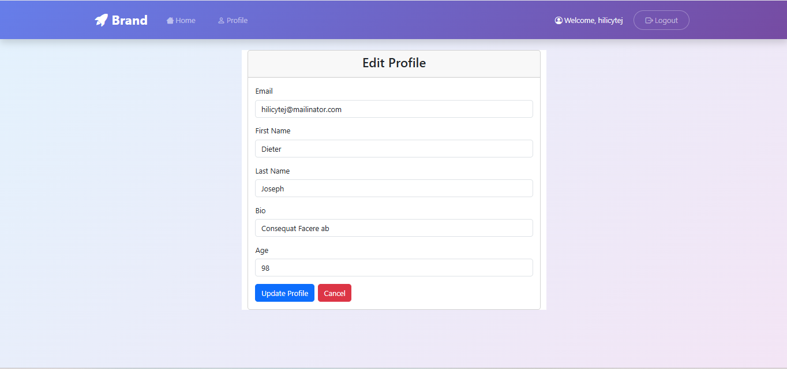

# ⚛️ React Local Authentication App


## 🚀 Introduction

This project is a **simple authentication system built with React** that uses **Local Storage** and **Redux Toolkit (Slice)** to manage user sessions.  
It demonstrates how to implement login, registration, and session persistence locally — perfect for learning client-side authentication in React.

---

## 📂 Directory Structure

```bash
reactLocalAuth/
├── node_modules/
├── public/
│   ├── index.html
│   └── favicon.ico
├── src/
│   ├── components/
│   │   ├── Home.js
│   │   ├── Login.js
│   │   ├── Profile.js
│   │   ├── Signup.js
│   │   └── Dashboard.js
│   ├── common/
│   │   └── Navbar.js
│   ├── store/
│   │   ├── index.js
│   │   └── slice/
│   │       └── usersSlice.js
│   ├── App.js
│   ├── main.jsx
│   └── index.css
├── .gitignore
├── package.json
└── README.md
```

🧠 Working Demo Preview
<div align="center">
  
  
  
  
  
</div>


👨‍💻 Author

Shaikh Sohel
📍 Ahmedabad, India
💼 MCA Student at LJ University
🌐 GitHub Profile